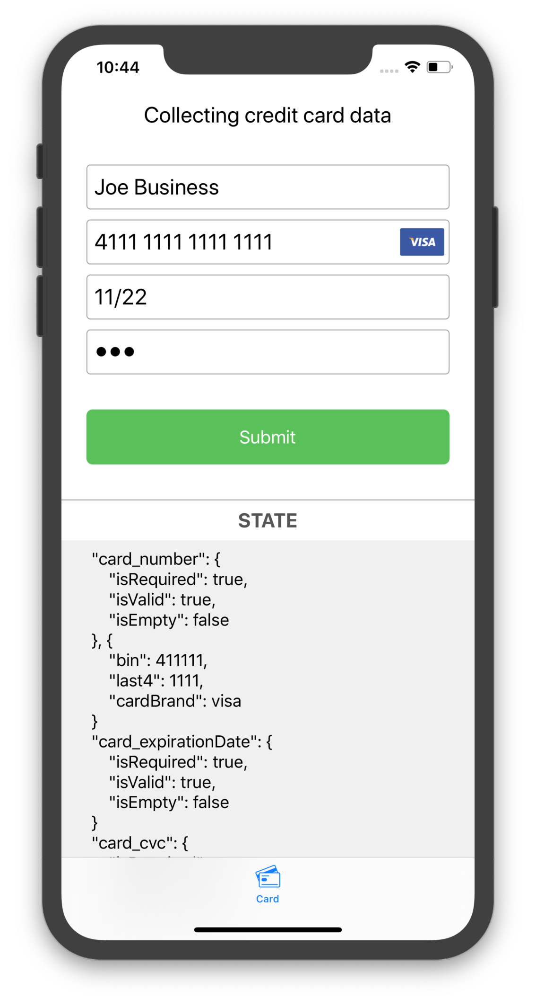
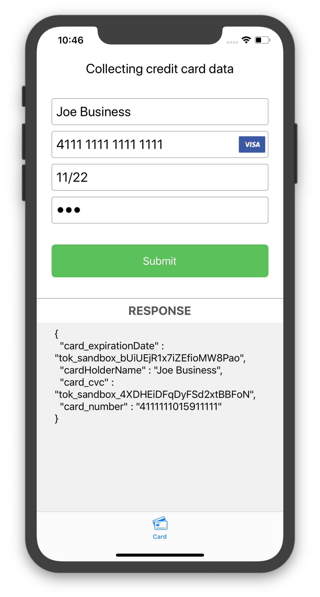

[]()
[](https://github.com/verygoodsecurity/vgs-collect-ios)
[]()
[]()
[]()
[](https://cocoapods.org/pods/VGSCollectSDK)
[]()


# VGS Collect iOS SDK

VGS Collect lets you capture sensitive user data (payment cards, PII, files) without that raw data ever traversing or being stored within your infrastructure. `VGSCollectSDK` provides secure UI elements (text fields, file picker, card scanning) that look & behave like native inputs while enforcing client‑side validation and secure submission to a VGS Vault.

## Table of Contents
<!--ts-->
* [Before You Start](#before-you-start)
* [Features](#features)
* [Integration](#integration)
  * [Swift Package Manager](#swift-package-manager)
  * [CocoaPods](#cocoapods)
* [AI Agent Integration](#ai-agent-integration)
* [Quick Start](#quick-start)
  * [Initialize & Configure Fields](#initialize--configure-fields)
  * [Observe Field State](#observe-field-state)
  * [Submit Data](#submit-data)
* [Card Scanning](#card-scanning)
* [File Upload](#file-upload)
* [SwiftUI Support](#swiftui-support)
* [Demo Application](#demo-application)
* [Documentation](#documentation)
* [Releases](#releases)
* [Analytics & Privacy](#analytics--privacy)
* [Security Guidance](#security-guidance)
* [Dependencies](#dependencies)
* [License](#license)
<!--te-->

<p align="center">
  
  
</p>

## Before You Start
Create an organization at the <a href="https://dashboard.verygoodsecurity.com/dashboard/">VGS Dashboard</a>. A sandbox vault is created automatically. Use your vault ID (`<vaultId>`) when initializing the collector.

## Features
- Secure text input elements with masking, formatting, validation & metadata (card brand, BIN, last4).
- Audited credit card scanning (BlinkCard) via VGS‑provided modules.
- Secure file picker & upload with explicit post‑upload cleanup.
- Field state observation API to drive UI (enable/disable actions based on validity).
- Multiple submission APIs (closure, async/await, Combine publisher variants).
- SwiftUI wrappers for all provided text field types.

## Integration

### Swift Package Manager
Requires Swift tools version 5.9 or higher. Check your installed version:
```bash
xcrun swift -version
```
Add the package in Xcode using the repository URL:
```
https://github.com/verygoodsecurity/vgs-collect-ios.git
```
Select the exact version you want to pin, then add `VGSCollectSDK` and optionally scanning/file modules (e.g. `VGSBlinkCardCollector`). Pinning versions ensures reproducible builds.

### CocoaPods
Add to your `Podfile`:
```ruby
pod 'VGSCollectSDK'              # Core
pod 'VGSCollectSDK/BlinkCard'    # Optional card scan provider
```
Install:
```bash
pod repo update
pod install
```
Always pin versions to avoid accidental upgrades.

## AI Agent Integration
Use [`AGENTS.md`](./AGENTS.md) as the single authoritative context for autonomous coding agents integrating or maintaining `VGSCollectSDK`. It lists public APIs, security constraints, validation rules, upgrade & testing expectations.

Minimal System Prompt Example:
```
You are an autonomous engineering agent integrating the VGS Collect iOS SDK into an existing Swift app.
Use the full contents of AGENTS.md as the authoritative policy.
Constraints:
- Only public, non-deprecated APIs.
- No raw sensitive data in logs/tests.
- Validate all fields before submission.
- Clean files after successful upload.
Goals:
1. Add a secure card form (number, name, exp, cvc) with redacted logging.
2. Integrate BlinkCard scanning.
3. Provide unit tests for valid/invalid card + expiration edge case.
Return: Modified Swift source files only, no secrets.
```

Developer Prompt (Inline Example for a Single Task):
```
Task: Add a custom payment card brand "mycard" (BIN starts with 7777) and ensure CVC field adapts.
Follow AGENTS.md Section 2B.
Do not break existing brand detection; add tests for detection and negative near-miss.
```

## Quick Start

### Import SDK
```swift
import VGSCollectSDK
```

### Initialize & Configure Fields
```swift
// Initialize collector with your vault ID (sandbox example)
let collector = VGSCollect(id: "<vaultId>", environment: .sandbox)

// Card number field
let cardNumberField = VGSCardTextField()
let cardConfig = VGSConfiguration(collector: collector, fieldName: "card_number")
cardConfig.type = .cardNumber
cardConfig.isRequiredValidOnly = true
cardNumberField.configuration = cardConfig
cardNumberField.placeholder = "Card Number"

// Cardholder name
let nameField = VGSTextField()
let nameConfig = VGSConfiguration(collector: collector, fieldName: "card_holder")
nameConfig.type = .name
nameField.configuration = nameConfig
nameField.placeholder = "Name on Card"

// Expiration date
let expField = VGSTextField()
let expConfig = VGSConfiguration(collector: collector, fieldName: "exp_date")
expConfig.type = .expDate
expConfig.formatPattern = "##/##"  // MM/YY
expConfig.divider = "/"
expConfig.isRequiredValidOnly = true
expField.configuration = expConfig
expField.placeholder = "MM/YY"

// CVC
let cvcField = VGSTextField()
let cvcConfig = VGSConfiguration(collector: collector, fieldName: "cvc")
cvcConfig.type = .cvc
cvcConfig.isRequiredValidOnly = true
cvcField.configuration = cvcConfig
cvcField.placeholder = "CVC"
```
Add these fields to your view hierarchy (e.g. a `UIStackView`).

### Observe Field State
```swift
cardNumberField.delegate = self

extension ViewController: VGSTextFieldDelegate {
  func vgsTextFieldDidChange(_ textField: VGSTextField) {
    textField.borderColor = textField.state.isValid ? .gray : .red
    if let cardState = textField.state as? VGSCardState, cardState.isValid {
      print("Card submitted brand=\(cardState.cardBrand.stringValue) last4=\(cardState.last4)") // Redacted logging
    }
  }
}
```

### Submit Data
Validate before submitting:
```swift
func submit() {
  let fields = [cardNumberField, nameField, expField, cvcField]
  guard fields.allSatisfy({ $0.state.isValid }) else {
    // Highlight invalid fields instead of sending
    return
  }

  let extraData: [String: Any] = ["customKey": "Custom Value"]
  collector.sendData(path: "/post", extraData: extraData) { response in
    switch response {
    case .success(let statusCode, let data, _):
      // Parse alias JSON in `data`
      print("Success status=\(statusCode) aliases=\(String(describing: data))")
    case .failure(let statusCode, let data, _, let error):
      // Map status and show user-friendly message
      print("Failure status=\(String(describing: statusCode)) error=\(error?.localizedDescription ?? "unknown")")
    }
  }
}
```

**Note:** `VGSCardTextField` automatically detects and shows the card brand icon for card number input.

## Card Scanning
Use only VGS‑provided scan subspecs or SPM targets.

### CocoaPods Example
```ruby
pod 'VGSCollectSDK'
pod 'VGSCollectSDK/BlinkCard'
```
### Swift Package Manager
Add `VGSCollectSDK` and `VGSBlinkCardCollector` targets.

### Usage
```swift
import VGSCollectSDK
import VGSBlinkCardCollector

class ViewController: UIViewController, VGSBlinkCardControllerDelegate {
  var scanController: VGSBlinkCardController?

  override func viewDidLoad() {
    super.viewDidLoad()
    scanController = VGSBlinkCardController(licenseKey: "<blinkCardLicenseKey>", delegate: self) { code in
      print("BlinkCard license error code=\(code)")
    }
  }

  func scanCard() {
    scanController?.presentCardScanner(on: self, animated: true, modalPresentationStyle: .fullScreen, completion: nil)
  }

  // MARK: - VGSBlinkCardControllerDelegate
  func textFieldForScannedData(type: VGSBlinkCardDataType) -> VGSTextField? {
    switch type {
    case .cardNumber: return cardNumberField
    case .expirationDate: return expField
    case .cvc: return cvcField
    case .name: return nameField
    default: return nil
    }
  }

  func userDidFinishScan() {
    scanController?.dismissCardScanner(animated: true) {
      // Post-dismiss actions
    }
  }

  func userDidCancelScan() {
    scanController?.dismissCardScanner(animated: true)
  }
}
```
Add `NSCameraUsageDescription` to your app's `Info.plist` with a clear purpose string.

## File Upload
Add secure file selection & upload with `VGSFilePickerController`.
```swift
class FilePickerViewController: UIViewController, VGSFilePickerControllerDelegate {
  let collector = VGSCollect(id: "<vaultId>", environment: .sandbox)
  var filePicker: VGSFilePickerController?

  override func viewDidLoad() {
    super.viewDidLoad()
    let cfg = VGSFilePickerConfiguration(collector: collector, fieldName: "secret_doc", fileSource: .photoLibrary)
    filePicker = VGSFilePickerController(configuration: cfg)
    filePicker?.delegate = self
  }

  func presentPicker() {
    filePicker?.presentFilePicker(on: self, animated: true, completion: nil)
  }

  // MARK: - VGSFilePickerControllerDelegate
  func userDidPickFileWithInfo(_ info: VGSFileInfo) {
    print("File selected ext=\(info.fileExtension ?? "unknown") size=\(info.size)\(info.sizeUnits ?? "")")
    filePicker?.dismissFilePicker(animated: true) { [weak self] in
      self?.sendFile()
    }
  }

  func userDidSCancelFilePicking() { // Delegate name includes 'S' per current API
    filePicker?.dismissFilePicker(animated: true)
  }

  func filePickingFailedWithError(_ error: VGSError) {
    filePicker?.dismissFilePicker(animated: true)
  }

  private func sendFile() {
    let extra = ["document_holder": "Joe B"]
    collector.sendFile(path: "/post", extraData: extra) { [weak self] response in
      switch response {
      case .success:
        self?.collector.cleanFiles() // Cleanup after successful upload
      case .failure(let status, _, _, let error):
        print("Upload failed status=\(String(describing: status)) error=\(error?.localizedDescription ?? "unknown")")
      }
    }
  }
}
```
Use `collector.cleanFiles()` whenever you need to unassign a file (always after a successful upload).

## SwiftUI Support
The SDK provides SwiftUI wrappers for all text fields, enabling reactive, declarative UIs without exposing raw sensitive input to `@State`. 

## Demo Application
Sample card collection application: <a href="https://github.com/vgs-samples/very-spacy-food-iOS">Very Spacy Food iOS</a>.

## Documentation
- SDK Guide: https://docs.verygoodsecurity.com/vault/developer-tools/vgs-collect/ios-sdk
- API Reference: https://verygoodsecurity.github.io/vgs-collect-ios/

## Releases
Track updates & migration notes: https://github.com/verygoodsecurity/vgs-collect-ios/releases

## Analytics & Privacy
`VGSCollectSDK` tracks limited, non-personal usage metrics (feature adoption) to improve the SDK. No raw sensitive data is collected.
Opt out if required:
```swift
VGSAnalyticsClient.shared.shouldCollectAnalytics = false
```
Read more: https://www.verygoodsecurity.com/docs/vgs-collect/ios-sdk/privacy-details

## Security Guidance
If you discover a security concern, follow responsible disclosure guidelines in the [`SECURITY.md`](./SECURITY.md) and avoid sharing sensitive details publicly.

## Dependencies
- iOS 13+
- Swift 5.9+
- Optional third‑party scan library via subspec or SPM target:
  - [BlinkCard](https://github.com/blinkcard/blinkcard-ios)

## License
VGSCollect iOS SDK is released under the MIT License. See [LICENSE](https://github.com/verygoodsecurity/vgs-collect-ios/blob/master/LICENSE) for details.

---
