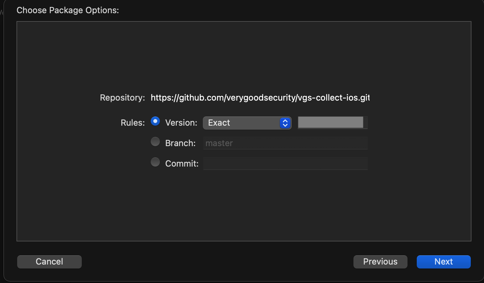
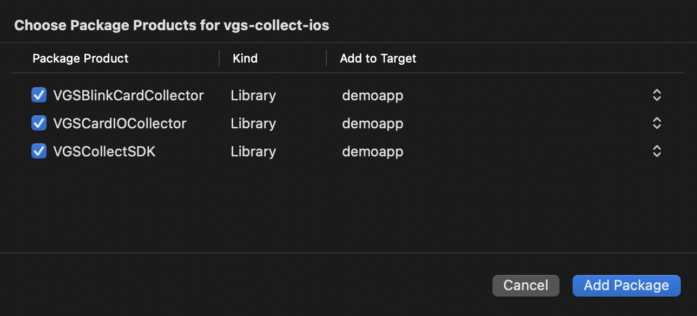

[](https://dl.circleci.com/status-badge/redirect/gh/verygoodsecurity/vgs-collect-ios/tree/master)
[]()
[](https://github.com/verygoodsecurity/vgs-collect-ios)
[]()
[]()
[]()
[](https://cocoapods.org/pods/VGSCollectSDK)


# VGS Collect iOS SDK

VGS Collect - is a product suite that allows customers to collect information securely without possession of it. VGSCollect iOS SDK  allows you to securely collect data from your users via forms without having to have that data pass through your systems. The form fields behave like traditional input fields while securing access to the unsecured data.

Table of contents
=================

<!--ts-->
   * [Before you start](#before-you-start)
   * [Integration](#integration)
      * [Swift Package Manager](#swift-package-manager) 
      * [CocoaPods](#cocoapods)
   * [Usage](#usage)
      * [Create VGSCollect instance and VGS UI Elements](#create-vgscollect-instance-and-vgs-ui-elements)
      * [Scan Credit Card Data](#scan-credit-card-data)
      * [Upload Files](#upload-files)
      * [SwiftUI support](#swiftui-support)
      * [Demo Application](#demo-application)
      * [Documentation](#documentation)
      * [Releases](#releases)
      * [Privacy](#privacy)
   * [Dependencies](#dependencies)
   * [License](#license)
<!--te-->

<p align="center">
	
	
</p>


## Before you start
You should have your organization registered at <a href="https://dashboard.verygoodsecurity.com/dashboard/">VGS Dashboard</a>. Sandbox vault will be pre-created for you. You should use your `<vaultId>` to start collecting data. Follow integration guide below.

# Integration

### Swift Package Manager 

The [Swift Package Manager](https://swift.org/package-manager/) is a tool for automating the distribution of Swift code and is integrated into the `swift` compiler.
Xcode with Swift tools version of 5.9+ is required for VGSCollectSDK.
To check your current Swift tools version run in your terminal:

```ruby
xcrun swift -version
```

To use Swift Package Manager, in Xcode add the https://github.com/verygoodsecurity/vgs-collect-ios.git dependency and choose the `Exact` version.
<p align="center">

</p>

Select `VGSCollectSDK` and optionally other packages provided with `VGSCollectSDK`:

<p align="center">

</p>

### CocoaPods

[CocoaPods](https://cocoapods.org) is a dependency manager for Cocoa projects. For usage and installation instructions, visit CocoaPods website. To integrate VGSCollectSDK into your Xcode project using CocoaPods, specify it in your `Podfile`:

```ruby
pod 'VGSCollectSDK'
```

## Usage

### Import SDK into your file
```swift

import VGSCollectSDK

```
### Create VGSCollect instance and VGS UI Elements
Use your `<vaultId>` to initialize VGSCollect instance. You can get it in your [organisation dashboard](https://dashboard.verygoodsecurity.com/).

### Code example

<table>
  <tr">
    <th >Here's an example</th>
    <th width="27%">In Action</th>
  </tr>
  <tr>
    <td>Customize  VGSTextFields...</td>
     <th rowspan="2"></th>
  </tr>
  <tr>
    <td>

    /// Initialize VGSCollect instance
    var vgsCollect = VGSCollect(id: "vauiltId", environment: .sandbox)

    /// VGS UI Elements
    var cardNumberField = VGSCardTextField()
    var cardHolderNameField = VGSTextField()
    var expCardDateField = VGSTextField()
    var cvcField = VGSTextField()

    /// Native UI Elements
    @IBOutlet weak var stackView: UIStackView!

    override func viewDidLoad() {
        super.viewDidLoad()

        /// Create card number field configuration
        let cardConfiguration = VGSConfiguration(collector: vgsCollect,
	                                         fieldName: "card_number")
        cardConfiguration.type = .cardNumber
        cardConfiguration.isRequiredValidOnly = true

        /// Setup configuration to card number field
        cardNumberField.configuration = cardConfiguration
        cardNumberField.placeholder = "Card Number"
        stackView.addArrangedSubview(cardNumberField)

        /// Setup next textfields...
    }
    ...
  </td>
  </tr>
  <tr>
    <td>... observe filed states </td>
     <th rowspan="2"></th>
  </tr>
  <tr>
    <td>
	
    override func viewDidLoad() {
        super.viewDidLoad()
        ...
        
        /// Setup delegate
        cardNumberField.delegate = self
    }
    
  extension ViewController: VGSTextFieldDelegate {
    func vgsTextFieldDidChange(_ textField: VGSTextField) {
      textField.borderColor = textField.state.isValid  ? .gray : .red

      /// Check Card Number Field State with addition attributes
      if let cardState = textField.state as? VGSCardState, cardState.isValid {
          print("THIS IS: \(cardState.cardBrand.stringValue) - \(cardState.bin.prefix(4)) **** **** \(cardState.last4)")
      }
    }
  }
  </td>
  </tr>
  <tr>
    <td colspan="2">... send data to your Vault</td>
  </tr>
  <tr>
    <td colspan="2">
        
    // ...

    // MARK: - Send data    
    func sendData() {
    
        /// handle fields validation before send data
        guard cardNumberField.state.isValid else {
		print("cardNumberField input is not valid")
        }
	
        /// extra information will be sent together with all sensitive card information
        var extraData = [String: Any]()
        extraData["customKey"] = "Custom Value"

        /// send data to your Vault
        vgsCollect.sendData(path: "/post", extraData: extraData) { [weak self](response) in
          switch response {
            case .success(let code, let data, let response):
              // parse data
            case .failure(let code, let data, let response, let error):
              // handle failed request
              switch code {
                // handle error codes
              }
          }
        }
    }
  </td>
  </tr>
</table>

**VGSCardTextField** automatically detects card provider and display card brand icon in the input field.


### Scan Credit Card Data
VGS Collect SDK provides optional card scan solution. It's required to use only Scan modules provided by VGS, which are audited by VGS PCI requirements.

#### Integrate with Cocoapods

Add 'VGSCollectSDK' alongside with one of scan modules pod:

```ruby
pod 'VGSCollectSDK'

# Add one of available scan providers
pod 'VGSCollectSDK/BlinkCard'  
```
#### Integrate with Swift Package Manager

To use **BlinkCard** add `VGSCollectSDK`, `VGSBlinkCardCollector` packages to your target. 

#### Code Example

<table>
  <tr>
    <th>Here's an example</th>
    <th width="25%">In Action</th>
  </tr>
  <tr>
    <td>Setup  VGSBlinkCardController...</td>
    <th rowspan="2"></th>
  </tr>
  <tr>
    <td>
    
    class ViewController: UIViewController {
        /// Init VGSBlinkCardController
        var scanController: VGSBlinkCardController?

        /// Init VGSTextFields...

        override func viewDidLoad() {
          super.viewDidLoad()

          // Init VGSBlinkCardController with BlinkCard license key and delegate
            scanController = VGSBlinkCardController(licenseKey: "<blinkCardLicenseKey>", delegate: self, onError: { errorCode in
              print("BlinkCard license error, code: \(errorCode)")
            })
        }

        /// Present scan controller 
        func scanData() {
          scanController?.presentCardScanner(on: self, animated: true, modalPresentationStyle: .fullScreen, completion: nil)
        }
    }
    ...
  </td>
  </tr>
  <tr>
    <td colspan="2">... handle VGSBlinkCardControllerDelegate</td>
  </tr>
  <tr>
    <td colspan="2">
	    
    // ...
    
    /// Implement VGSBlinkCardControllerDelegate methods
  extension ViewController: VGSBlinkCardControllerDelegate {
    func textFieldForScannedData(type: VGSBlinkCardDataType) -> VGSTextField? {
      // match VGSTextField with scanned data
      switch type {
      case .expirationDate:
          return expCardDate
      case .cardNumber:
          return cardNumber
      case .cvc:
        return cvcCardNum
      case .name:
        return cardHolderName
      default:
          return nil
      }
    }
  
    func userDidFinishScan() {
      scanController?.dismissCardScanner(animated: true, completion: {
          // add actions on scan controller dismiss completion
      })
    }
  
    func userDidCancelScan() {
      scanController?.dismissCardScanner(animated: true, completion: {
          // add actions on scan controller dismiss completion
      })
    }
  }

  </td>
  </tr>
</table>

Handle `VGSBlinkCardControllerDelegate` functions. To setup scanned data into specific  VGSTextField implement `textFieldForScannedData:` . If scanned data is valid it will be set in your VGSTextField automatically after user confirmation. Check  `VGSBlinkCardDataType` to get available scand data types.

Don't forget to add **NSCameraUsageDescription** key and description into your App ``Info.plist``.

### Upload Files

You can add a file uploading functionality to your application with **VGSFilePickerController**.

#### Code Example

<table>
  <tr">
    <th  colspan="2>Here's an example</th>
  </tr>
  <tr>
    <td colspan="2">Setup  VGSFilePickerController...</td>
  </tr>
  <tr>
    <td colspan="2">
	    
    class FilePickerViewController: UIViewController, VGSFilePickerControllerDelegate {

	  var vgsCollect = VGSCollect(id: "vailtId", environment: .sandbox)
	  
	  /// Create strong referrence of VGSFilePickerController
	  var pickerController: VGSFilePickerController?

	  override func viewDidLoad() {
	      super.viewDidLoad()

	      /// create picker configuration
	      let filePickerConfig = VGSFilePickerConfiguration(collector: vgsCollect,
	      							fieldName: "secret_doc",
							       fileSource: .photoLibrary)

	      /// init picket controller with configuration
	      pickerController = VGSFilePickerController(configuration: filePickerConfig)

	      /// handle picker delegates
	      pickerController?.delegate = self
	  }

	  /// Present picker controller
	  func presentFilePicker() {
	      pickerController?.presentFilePicker(on: self, animated: true, completion: nil)
	  }
	}
	...
  </td>
  </tr>
  <tr>
    <td>... handle VGSFilePickerControllerDelegate</td>
    <th width="27%">In Action</th>
  </tr>
  <tr>
    <td>
	
	// ...  
	
	// MARK: - VGSFilePickerControllerDelegate
	/// Check file info, selected by user
	func userDidPickFileWithInfo(_ info: VGSFileInfo) {
		let fileInfo = """
			    File info:
			    - fileExtension: \(info.fileExtension ?? "unknown")
			    - size: \(info.size)
			    - sizeUnits: \(info.sizeUnits ?? "unknown")
			    """
		print(fileInfo)
		pickerController?.dismissFilePicker(animated: true,
						  completion: { [weak self] in
						  
			self?.sendFile()
		})
	}

	// Handle cancel file selection
	func userDidSCancelFilePicking() {
		pickerController?.dismissFilePicker(animated: true)
	}

	// Handle errors on picking the file
	func filePickingFailedWithError(_ error: VGSError) {
		pickerController?.dismissFilePicker(animated: true)
	}
   
  </td>
  <td></td>
  </tr>
  <tr>
    <td colspan="2">... send file to your Vault</td>
  </tr>
  <tr>
    <td colspan="2">
	    
	// ...

	// MARK: - Send File	
	/// Send file and extra data
	func sendFile() {
	
		/// add extra data to send request	
		let extraData = ["document_holder": "Joe B"]
    
      /// send file to your Vault
      vgsCollect.sendFile(path: "/post", extraData: extraData) { [weak self](response) in
        switch response {
          case .success(let code, let data, let response):
            /// remove file from VGSCollect storage
            self?.vgsCollect.cleanFiles()
          case .failure(let code, let data, let response, let error):
            // handle failed request
            switch code {
              // handle error codes
            }
        }
      }
	}
  </td>
  </tr>
</table>

Use vgsCollect.cleanFiles() to unassign file from associated VGSCollect instance whenever you need.

### SwiftUI support

VGS Collect iOS SDK provide support for integration with apps that are buid with SwiftUI toolkit by providing SwiftUI wrappers for all VGS textfields. Follow examples [here](./demoapp/demoapp/UseCases/SwiftUI/README.md).

## Demo Application
Demo application for collecting card data on iOS is <a href="https://github.com/vgs-samples/very-spacy-food-iOS">here</a>.


### Documentation
-  SDK Documentation: https://www.verygoodsecurity.com/docs/vgs-collect/ios-sdk
-  API Documentation: https://verygoodsecurity.github.io/vgs-collect-ios/

### Releases
To follow `VGSCollectSDK` updates and changes check the [releases](https://github.com/verygoodsecurity/vgs-collect-ios/releases) page.

### Privacy
VGSCollectSDK tracks a few key metrics to understand SDK features usage, which helps us know what areas need improvement. No personal information is tracked.
You can read more about VGS Privacy details ans iOS Privacy Manifest file at our [web site](https://www.verygoodsecurity.com/docs/vgs-collect/ios-sdk/privacy-details).

You can opt-out of metrics collection in `VGSAnalyticsClient`:
```
VGSAnalyticsClient.shared.shouldCollectAnalytics = false
```

## Dependencies
- iOS 13+
- Swift 5.9
- Optional 3rd party libraries:
  - [BlinkCard](https://github.com/blinkcard/blinkcard-ios)

## License

 VGSCollect iOS SDK is released under the MIT license. [See LICENSE](https://github.com/verygoodsecurity/vgs-collect-ios/blob/master/LICENSE) for details.
