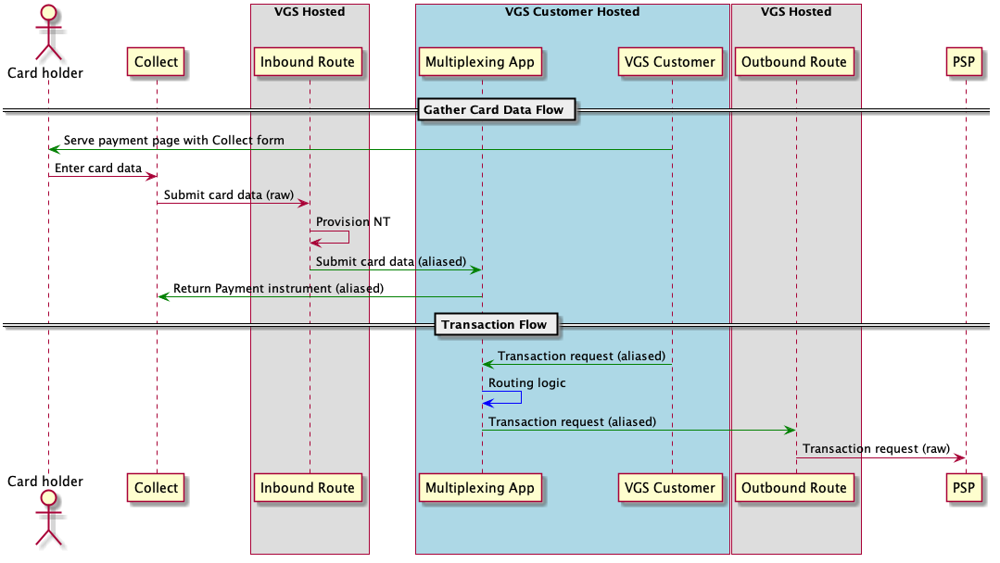

<p align="center"><a href="https://www.verygoodsecurity.com/"></a></p>
<p align="center"><i>Integration of VGS Collect iOS SDK with VGS Muptiplexing App</i></p>

The [VGS Multiplexing](https://github.com/verygoodsecurity/multiplexing/blob/master/integration/README.md) app facilitates payment multiplexing with integrations to 120+ gateways. This example shows how you can secure data through VGS Collect iOS SDK while using our payment gateway multiplexer.

## Flow diagram

<p align="center">
  
</p>

## How to run multiplexing sample

1. Follow the instructions and install [Multiplexing](https://github.com/verygoodsecurity/multiplexing/blob/master/integration/README.md) app. (Contact support@verygoodsecurity.com if you need access)

2. In `DemoApp`,  change `vaultId` to your vault id in `AppCollectorConfiguration` associated with Multiplexing setup.

3. Run `DemoApp` and select `Collect Card for Multiplexing`.

4. Fill in form with valid card data and press `Upload`. With provided Collect setup, form will make a request to the `/api/v1/financial_instruments` endpoint with the following data structure:

```
{
  "data": {
    "type":"financial_instruments",
    "attributes": {
      "instrument_type":"card",
      "details": {
        "first_name":"John",
        "last_name":"Doe",
        "number":"4111111111111111",
        "month":"1",
        "year":"2029",
        "verification_value":"111"
      }
    }
  }
}
```
