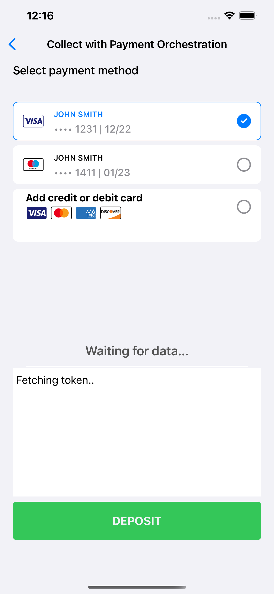

# Collect+PaymentOrchestration

## Overview

[VGS Collect iOS SDK](https://github.com/verygoodsecurity/vgs-collect-ios) can be used with [VGS Payment Orchestration Service](https://www.verygoodsecurity.com/payment-optimization), our payment optimization solution.
VGS Payment Orchestration offers an API to facilitate the routing of your payment transactions to 180+ gateways. With payment orchestration, payment facilitators and merchants are able to minimize their payment processing costs.

VGS offers Universal Checkout experience with [VGS Checkout iOS SDK](https://github.com/verygoodsecurity/vgs-checkout-ios), complete checkout experience that is fully integrated with our payment optimization solution. 
VGS Checkout iOS SDK provides a separate presented page with Checkout form to collect card and billing information from customer.

In some cases you may want to build your own custom UI&UX checkout experience with VGS Payment Orchestration. For this purpose you can use VGS Collect iOS SDK to collect PCI card data and send it to Payment Orchestration. 

Check `CollectPayoptIntegrationViewConroller` class which illustrates how to use VGS Collect iOS SDK with payment optimization.

<p align="center">
	
	
</p>


## Steps to integrate Collect with Payment Orchestration

### 1.Implement your custom backend and iOS API client to fetch access token valid for Payment Orchestration operations.  

### 2. Setup VGS Collect instance.

### 3. Build your own UI with `VGSTextFields` and connect `VGSCollect` instance to text fields. ayload structure for payment optimization should match the following structure:

```JSON
{
  "card": {
    "name": "John Doe",
    "number": "4242 4242 4242 4242",
    "exp_month": "05",
    "exp_year": "2035",
    "cvc": "123"
  }
}
```

Set proper fielnames to match payment optimization JSON.

### 4. Collect and submit card data to Payment Orchestration to create financial instrument. Don't forget to set authorization token. 

```swift
   		vgsCollectNewCardFlow.customHeaders = ["Authorization": "Bearer \(payOptAccessToken)"]
		/// Send card data to "financial_instruments" path
		vgsCollectNewCardFlow.sendData(path: "/financial_instruments", routeId: AppCollectorConfiguration.shared.paymentOrchestrationDefaultRouteId) { [weak self] response in
			switch response {
			case .success(_, let data, _):
				/// Get fin instrument from response data
				guard let finId = self?.apiClient.financialInstrumentID(from: data) else {
					print("can't parse fin_id from data!")
					return
				}
				/// Save fin instrument in shared config
				AppCollectorConfiguration.shared.savedFinancialInstruments.append(finId)
				/// Make deposit request
				self?.deposit(50, finId: finId)
			case .failure(let code,  _, _, let error):
				print("\(code) + \(String(describing: error))")
				return
			}
		}
```

###5. If needed store created financial instruments on your side to display saved cards in future.


